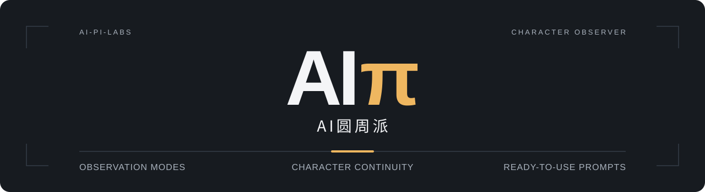

<p align="center">
  
</p>

<h1 align="center">Character Observer</h1>

<p align="center"><strong>One character. Nineteen ways to see.</strong><br>一个角色，十九种观察视角。</p>

<p align="center">
  
  
</p>

<p align="center"><a href="README.md">简体中文</a> · <strong>English</strong></p>

<p align="center">
  <a href="#start">Get started &amp; install</a> ·
  <a href="references/mode-examples.md">19 mode examples</a> ·
  <a href="#usage">Usage</a> ·
  <a href="SKILL.md">Skill source</a>
</p>

Describe an adult fictional character and get photography prompts across **19 observation modes**: surveillance-style framing, phone snapshots, telephoto views, reflections, architectural framing, and more. Request **1–20 prompts** at a time, varying scenes, actions, and composition while retaining the character's defining features.

**Prompts are delivered in Chinese by default.** Copy a finished prompt into your image-generation tool. This repository provides text instructions, not an image-generation service, and has no program to run. The skill source and detailed mode examples are in Chinese; this page explains their use in English.

- [Complete skill instructions](SKILL.md)
- [All 19 modes: calls and complete image prompts](references/mode-examples.md)

<a id="start"></a>

## Get started & install

### Option A: copy the instructions without installing

1. Open [SKILL.md](SKILL.md) and copy its complete contents into a task with an AI assistant that supports long text.
2. Send a character description and request, for example:

```text
Follow the skill instructions above to create prompts for an original, fictional 28-year-old city traveler.
mode=reflection n=3 scene="a shopping street after rain"
Short black hair, a navy coat, khaki trousers, white sneakers; fully clothed.
Prompts only.
```

3. Copy one complete prompt from the response into your image-generation tool. Provide the [mode examples](references/mode-examples.md) to the assistant if you want it to refer to them.

This route uses text instructions and does not require the assistant to recognize `$character-observer` as a skill command.

### Option B: install in local Codex

Ask Codex:

```text
Use $skill-installer to install the skill at the root of
https://github.com/ai-pi-labs/character-observer
into my local environment. Keep the references folder.
```

This repository is private, so installation requires a GitHub account with access. You can also download the repository, name the folder `character-observer`, and place it in your personal skills directory. Keep the following files together:

```text
~/.agents/skills/character-observer/
├── SKILL.md
├── README.md
└── references/
    └── mode-examples.md
```

Codex supports the personal `~/.agents/skills` and project `.agents/skills` directories. Restart Codex if the new skill does not appear. In the CLI or IDE extension, use `$` to mention it. See the [official Codex skills documentation](https://learn.chatgpt.com/docs/build-skills) for loading paths and invocation.

<a id="usage"></a>

## Your first request

In a conversation where the skill has been loaded, send:

```text
$character-observer
character="original fictional 28-year-old city traveler, short slightly wavy black hair, navy coat, khaki trousers, white sneakers"
mode=smartphone n=1 scene="outside a café"
```

The response contains a parameter summary, a scene title, a complete photography prompt, and relevant things to avoid. Add “Prompts only” to omit the summary and explanation.

Natural language works too:

```text
Use character-observer to write three phone-snapshot prompts for an original fictional 28-year-old city traveler.
Set them outside a café. Keep the outfit consistent, but vary the actions and compositions. Prompts only.
```

## Common requests

<details>
<summary>Seven examples: batches, mixed views, camera reactions, and continuous actions</summary>

### Five scenes using one observation mode

```text
$character-observer original fictional 28-year-old bookstore clerk
mode=occluded n=5 scene=bookstore continuity=same-character
```

All five use foreground occlusion, varying the action, subject placement, foreground object, or observation point.

### Three observation modes for the same character

```text
$character-observer original fictional 28-year-old city traveler
mode=smartphone,reflection,paparazzi n=6
continuity=same-character discovered=off
```

This produces six prompts in total, cycling through the modes in order: two per mode. The character and clothing stay consistent.

### One prompt for each of the nineteen modes

```text
$character-observer original fictional 28-year-old female courier mode=all
```

`mode=all` defaults to nineteen prompts when `n` is omitted. With `mode=all n=5`, the total remains five, using the first five modes in the skill's order.

### Some scenes where the character notices the camera

```text
$character-observer original fictional 28-year-old city traveler
mode=smartphone n=8 discovered=25%
```

Two of the eight prompts show the character noticing the camera; the other six keep their attention on the action. These are consensually staged scenes. A mode without a plausible view of the camera will not force eye contact.

### A six-panel contact sheet of continuous action

```text
$character-observer original fictional 28-year-old city traveler
mode=contact-sheet n=1 panels=6 scene="a public café terrace"
```

This produces one complete grid prompt, showing the same character picking up a cup, drinking, setting it down, and continuing the sequence.

### Four camera positions for the same event

```text
$character-observer original fictional 28-year-old exhibition guide
mode=multi-cam n=1 panels=4 scene="exhibition entrance" discovered=off
```

This produces one four-panel prompt. The panels show the same moment from different camera positions, preserving the character's pose, direction, and prop state.

### Specify clothing, weather, and aspect ratio

```text
$character-observer
character="original fictional 28-year-old female courier, short black bob"
mode=dashcam n=3 style=写实
scene="shopping street" outfit="orange jacket, black trousers, sneakers"
time=dusk weather="after rain" ar=16:9 texture=balanced
discovered=off Prompts only.
```

</details>

## Choose from nineteen modes

Append the parameters to a character description, for example: `$character-observer original fictional 28-year-old city traveler mode=cctv n=1`. The [example document](references/mode-examples.md) contains complete image prompts for every mode, in the same order.

<details>
<summary>All 19 modes and their minimal parameters</summary>

| Mode | Look and suitable scene | Minimal parameters |
| --- | --- | --- |
| `cctv` | Fixed, elevated surveillance-style view; convenience store or lobby | `mode=cctv n=1` |
| `dashcam` | View through a windshield; shopping street or parking area | `mode=dashcam n=1` |
| `doorbell` | Ultra-wide doorbell view; public corridor or staged doorway | `mode=doorbell n=1` |
| `paparazzi` | Distant telephoto view; a fictional celebrity leaving an event | `mode=paparazzi n=1` |
| `smartphone` | Casual phone snapshot; everyday action and slightly tilted framing | `mode=smartphone n=1` |
| `reflection` | Character seen in a reflection; shop window or mirrored column | `mode=reflection n=1` |
| `bodycam` | Staff member's chest-mounted camera; guiding visitors at an exhibition | `mode=bodycam n=1` |
| `tourist` | Character happens to appear in a tourist photo; landmark or square | `mode=tourist n=1` |
| `news-camera` | Background of a fictional interview; pedestrian street or exhibition | `mode=news-camera n=1` |
| `contact-sheet` | Successive moments from one photography session | `mode=contact-sheet n=1 panels=6` |
| `multi-cam` | Different devices viewing the same event | `mode=multi-cam n=1 panels=4` |
| `occluded` | Foreground occlusion; shelves, plants, or a column | `mode=occluded n=1` |
| `architecture-frame` | Architectural framing; doorway, arcade, or colonnade | `mode=architecture-frame n=1` |
| `urban-observer` | A small figure in a distant city scene; square or crowd | `mode=urban-observer n=1` |
| `behind-the-scenes` | Event work photo; an authorized waiting or backstage area | `mode=behind-the-scenes n=1` |
| `camera-test` | Camera test before the subject has fully prepared | `mode=camera-test n=1` |
| `discovered-camera` | An interrupted action and a sideways glance toward the camera | `mode=discovered-camera n=1` |
| `public-transit` | Layers formed by handrails, door frames, and the carriage | `mode=public-transit n=1` |
| `low-angle-public` | Low-angle environmental portrait in a public space | `mode=low-angle-public n=1` |

</details>

## Parameter reference

<details>
<summary>Character, camera, continuity, and grid parameters</summary>

| Parameter | Default | Use |
| --- | --- | --- |
| `角色` / `character` | Original fictional 28-year-old city traveler | Specify age, appearance, color palette, and full outfit; explicitly adult fictional characters are supported |
| `mode` | `auto` | A single mode, comma-separated modes, or `all` |
| `n` | `1` | Total number of prompts, an integer from 1–20; `all` without `n` defaults to 19 |
| `style` | `真人COS` | Default: live-action cosplay. Other choices include `写实` (realistic), `二次元` (anime), `日系街拍` (Japanese street photography), `韩系生活记录` (Korean everyday-life photography), and `胶片` (film) |
| `scene` | `auto` | Public or authorized semi-public setting |
| `outfit` / `action` | `auto` | Complete clothing / an everyday action in progress |
| `time` / `weather` | `auto` | For example, dusk, after rain, or overcast |
| `lens` | `auto` | For example, `85mm`; must fit the mode's camera logic |
| `ar` | `auto` | For example, `3:4`, `16:9`, or `4:3` |
| `discovered` | `auto` | `off`, `on`, or `0–100%`; controls how many entries depict noticing the camera |
| `obstruction` | `auto` | Foreground occlusion as a percentage of the image, `0–40%` |
| `texture` | `balanced` | `clean` for fewer imperfections, `balanced` for a moderate amount, `rough` for more visible imperfections |
| `continuity` | `auto` | `same-character` locks character and clothing; `same-scene` also preserves the setting; `free` relaxes unspecified details |
| `layout` | `auto` | Ordinary modes use `single`; contact sheets and multi-camera views use `grid` |
| `panels` | `auto` | Images per grid: 4, 6, or 9; contact sheets default to 6, multi-camera views to 4 |
| `text` | `none` | `fictional-overlay` permits short fictional device IDs or timestamps |

See [SKILL.md](SKILL.md) for the complete defaults, conflict handling, and visual specifications. These parameters are text conventions for an assistant, not executable command-line arguments.

</details>

## Questions

<details>
<summary>Prompt counts, character consistency, image generation, and installation</summary>

**Does `n=6` generate six images?**

By default, it produces six prompts. Request actual images separately and use an image tool available in the current environment.

**What does `n=2 panels=6` produce?**

In a grid mode, it produces two prompts. Each describes one six-panel image: twelve panels in total.

**How do I keep the character consistent?**

Specify hair, color palette, clothing, accessories, and props, and use `continuity=same-character`. Use `same-scene` for continuous actions in one setting. These are prompt-level constraints; generated images still need a consistency check.

**Can I use it without understanding camera settings?**

Yes. Describe an adult fictional character and the feeling you want, and let the other settings remain automatic. For example: “Write three photo prompts that feel like a tourist happened to encounter the character.”

**How do I create a stronger sense of observation?**

Choose a specific action, plausible foreground occlusion, and a viewing position, such as “seeing the character leaf through a book from the end of a shelf.” `texture=rough` only adds imaging imperfections; it does not guarantee natural results or audience reach.

**What if the installed skill does not appear?**

Check that `character-observer/SKILL.md` sits directly under the skills directory, without an extra downloaded folder around it. Restart Codex, or use Option A above to provide the full instructions as text.

</details>

## Intended use

Use explicitly adult, adult-looking fictional characters or consenting adult performers, fully clothed, in public or authorized semi-public settings. This skill is not for privacy violations, nonconsensual photography of real people, minors, voyeuristic views into bathrooms, toilets, changing rooms, or bedrooms, or sexualized hidden-camera angles. Surveillance, news-camera, and camera-discovery effects are fictional visual styles.
