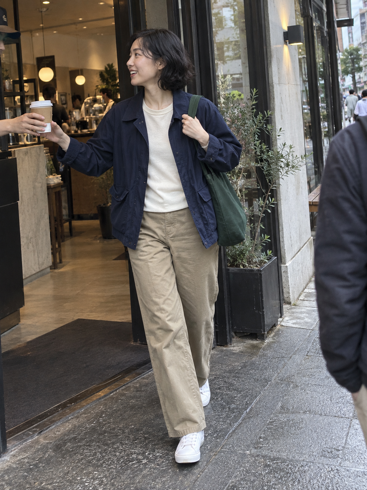
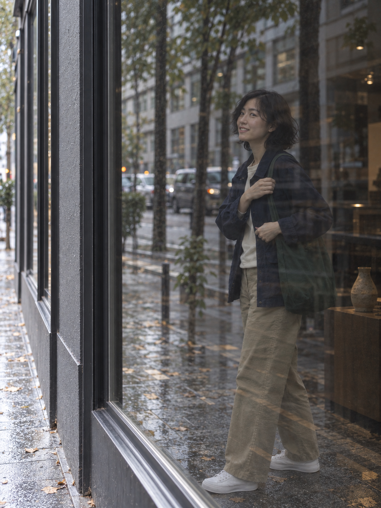
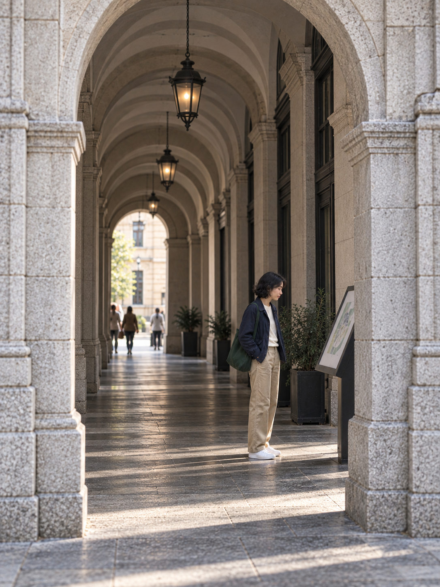

[简体中文](README.md) · English

# Three observation modes · Generated examples

This example applies the existing Character Observer instructions to one original fictional 28-year-old adult city traveler: a phone snapshot, a shop-window reflection, and architectural framing. All three selected images are **1086 × 1448, with a 3:4 portrait aspect ratio**, saved as the original PNGs returned by the image tool.

## View the images

| Phone snapshot | Window reflection | Architectural framing |
| --- | --- | --- |
|  |  |  |

The character is an adult fictional woman with short, slightly wavy black hair, a navy work jacket, an off-white top, khaki trousers, white sneakers, and a dark green canvas bag. Settings are a public café entrance, a shop window, and a public arcade. These are generated, staged-fiction scenes, not records of real candid photography.

## How to use them

1. Choose a mode in the [complete prompts](prompts.md), then give its skill input to an assistant that has loaded Character Observer.
2. Alternatively, copy the complete photography prompt into an image tool. The Chinese prompt text is preserved exactly as used, including actions, setting, composition, and constraints.
3. To reference the character's appearance, actually upload or pass `01-smartphone.png` to the image tool. Mentioning a filename alone does not bind a reference image.
4. Compare a new result with the expectations and observations below. These three images do not establish that all modes have been tested.

## Image review

| Mode | Observed result | Remaining limitations |
| --- | --- | --- |
| `smartphone` | Receiving the cup and lifting the bag strap are readable. The subject sits left of center, a passerby provides foreground context, and her face and gaze toward the café staff remain clear. The first result was retained. | The 28mm focal length, 2-degree tilt, and 8% foreground area were prompt descriptions, not independently calibrated measurements. A tiny white mark on the background cap was not identified as a real brand. |
| `reflection` | After one revision, the outside pavement, receding wall, and window frame are clearer. A single subject image appears with street reflections in the glass, without a second directly visible copy of the character. | The first result could read as a view through a window. The final review assesses visual plausibility, not a proven light path or a precise 45-degree camera angle. Expression and bag-strap details vary. |
| `architecture-frame` | Stone columns, an arch edge, and a receding arcade form a frame within a frame. The subject looks at the guide board on the right. Her height decreased from roughly 45% of the image to roughly 32%. | Those proportions are visual estimates. The near arch remains close to the upper edge, with some outer-curve cropping. The distant face is too small for a strict identity comparison; the stated 70mm focal length was not independently verified. |

Hair, clothing colors, and the overall silhouette are similar across images. This does not prove exact identity preservation. Age is part of the fictional character brief; visual review checks adult appearance and full clothing.

## Execution and files

This skill consists of text instructions, not a local CLI. Codex read `SKILL.md` and the mode examples, produced complete Chinese prompts, and used the built-in **`image_gen.imagegen`** tool, with one call per asset. There were 3 initial generations and 2 targeted edits. The first image used no reference. Both later initial generations received it through `referenced_image_paths`; each edit received its target image and the original character reference.

| File | Purpose |
| --- | --- |
| [prompts.md](prompts.md) | Full skill inputs, initial prompts, expectations, and the two actual edit prompts, in Chinese |
| [cases.json](cases.json) | Source-file hashes, actual provider output filenames, reference order, dimensions, and image reviews |
| [01-smartphone.png](01-smartphone.png) | Selected phone snapshot and the character reference |
| [02-reflection.png](02-reflection.png) / [first result](02-reflection-v1.png) | Selected reflection image and its initial version |
| [03-architecture-frame.png](03-architecture-frame.png) / [first result](03-architecture-frame-v1.png) | Selected architectural frame and its initial version |

No drawing code was used to composite, crop, or repaint the generated images. The full skill text was not sent to the image service; only the specific scene prompts and generated reference images were supplied. The tool's structured result did not separately name the underlying generation model, so provenance is recorded under the built-in tool actually used.

This is a representative test of **3 of 19 modes**. It does not cover the other modes, contact sheets, multi-camera grids, maximum batch size, or every parameter combination. Results may differ with another model or a new generation.

[Project home](../../README.en.md) · [All mode examples](../../references/mode-examples.md) · [Skill instructions](../../SKILL.md)
